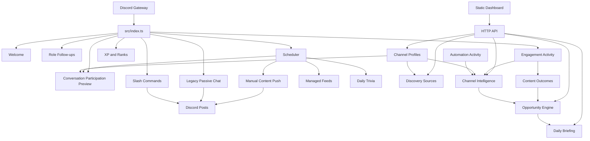
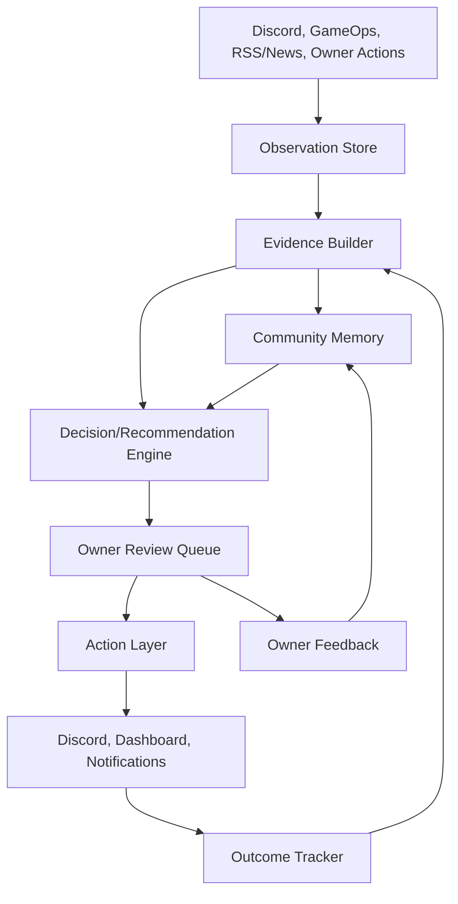

# Cdawg Bot Community Intelligence Platform Audit

Date: 2026-07-12

Scope: repository audit of the current Cdawg Bot workspace. This report is documentation only. No product feature, runtime behavior, automation setting, production data, or deployment was changed.

## A. Executive Assessment

Cdawg Bot is no longer just a basic Discord command bot. It has real operational foundations: Discord event handling, scheduled/manual publishing, welcome and role follow-up workflows, XP, dashboard controls, channel profiles, coarse engagement storage, content outcome tracking, deterministic opportunity generation, RSS discovery, and a preview-only conversation participation evaluator.

It is not yet a true Community Intelligence Platform. Most current "intelligence" is operational readiness and activity counting, not durable understanding of people, topics, conversations, or owner preference. The strongest foundation is that the bot already records enough trusted operational events to begin building evidence-backed recommendations. The weakest foundation is that raw observations, derived facts, recommendations, owner decisions, and outcomes are fragmented across small JSON stores with inconsistent schemas and limited provenance.

The dashboard does not need a cosmetic redesign for the next phase. The product pivot is architectural: create an evidence layer that converts existing trusted events into explainable facts before adding more AI, more recommendations, or any autonomous participation.

Overall maturity:

- Current stage: Stage 2 - Operational Assistant.
- Why: Cdawg can operate Discord workflows, post reviewed or scheduled content, record coarse activity/outcomes, and surface deterministic operational recommendations.
- Not Stage 3 yet: evidence is incomplete. Most conclusions are direct counts or configuration checks, not normalized, durable, explainable facts about community behavior.
- Evidence required to reach Stage 3: a shared event/evidence model, persisted recommendation lifecycle, message/reaction/reply observation, owner feedback capture, deduplication, and outcome records tied back to the original recommendation or post.

Strongest existing foundations:

- `src/index.ts`: central Discord event wiring for joins, role updates, messages, interactions, scheduler, and API startup.
- `src/systems/channel-intelligence.ts`: deterministic channel readiness summaries from profiles, topics, feeds, automation, role workflows, automation activity, and engagement.
- `src/systems/opportunity-engine.ts`: deterministic opportunity generation with supporting signals and confidence.
- `src/systems/engagement-activity.ts`: privacy-preserving message activity storage with author hashing and time-window summaries.
- `src/systems/content-outcomes.ts`: post outcome approximation using post time plus follow-on channel activity windows.
- `src/systems/conversation-participation.ts`: preview-only participation evaluator with safety gates, lulls, dead-channel suppression, cooldowns, caps, bot-ratio checks, and persisted decisions.
- `src/systems/discovery-sources.ts`: RSS discovery source storage, item deduplication, workflow state, and deterministic channel-profile matching.
- `src/systems/channel-profiles.ts`: explicit owner-authored channel memory.

Where the system overstates intelligence:

- "Channel intelligence" is mostly operational readiness plus coarse engagement, not conversation/topic/member understanding.
- "Content outcomes" measure channel activity after a post, not replies, reactions, unique responders to that post, or real discussion quality.
- "Opportunities" are useful deterministic rules, but they are not yet grounded in a full evidence/provenance model.
- "Discovery" can rank RSS items against channel profiles, but it is not yet a newsroom. YouTube/Reddit/local/generated source types exist in the model, but only RSS refresh is implemented.
- Palworld launch controls are dashboard-specific operational controls, not GameOps telemetry integration.

Most important architectural limitation: there is no unified observation -> evidence -> recommendation -> owner decision -> action -> outcome chain. Each subsystem writes its own JSON shape or keeps state in memory.

Biggest product risk: enabling conversation participation or broader automatic posting before the platform can explain decisions using durable evidence and learn from owner/community outcomes.

Best immediate opportunity: build a review-first "Daily Community Evidence Brief" from existing trusted data: channel activity, content outcomes, automation problems, role/welcome events, conversation preview decisions, and Palworld/Fantasy/Primal profile context.

## B. Existing Capability Inventory

| Subsystem | Purpose | Relevant files | Current status | Inputs | Outputs | Storage | Production active | Dashboard visible | Logic type | Affects real behavior | Tests | Limitations | Vision alignment |
|---|---|---|---|---|---|---|---|---|---|---|---|---|---|
| Discord bot entry point | Starts bot, scheduler, API; wires Discord events | `src/index.ts` | Active | Discord gateway events, env config | Commands, sends, records | Mixed delegated stores | Yes | Indirect | Deterministic | Yes | None direct | Central but tightly couples Discord to many systems |
| Welcome system | Sends welcome message on member join | `src/index.ts`, `src/lib/welcome.ts`, `src/systems/welcome-settings.ts` | Active if enabled | `GuildMemberAdd`, settings | Discord welcome post | `data/welcome-settings.json` when present | Yes | Yes | Deterministic templates | Yes | None found | Useful onboarding action, not intelligence yet |
| Role follow-ups | Sends role-specific follow-up after role added | `src/systems/role-followups.ts`, `src/config/role-followups.ts` | Active | `GuildMemberUpdate` | Discord follow-up post | `data/role-followups.json`; in-memory duplicate guard | Yes | Yes | Deterministic | Yes | None found | Good operational foundation; no outcome learning |
| Role access panels | Owner-managed role signup panels | `src/systems/role-access-panels.ts`, `src/index.ts`, `src/api/server.ts` | Active | Dashboard/API/button interactions | Role panel posts, role changes | `data/role-access-panels.json` | Yes | Yes | Deterministic | Yes | None found | Useful access workflow; no intelligence loop |
| Chat XP and ranks | Awards XP for eligible human chat and trivia | `src/index.ts`, `src/systems/xp.ts`, `src/lib/trivia-session.ts` | Active | Messages, trivia answers, commands | XP/rank state, milestone posts | `data/xp.json`; cooldowns in memory | Yes | Command visible | Deterministic | Yes | None found | Recognition foundation; raw activity can overvalue volume |
| Level share | Share level/rank achievement | `src/systems/level-share.ts` | Active button handler | Button interactions | Shared level post | In-memory/Discord event | Yes | No major dashboard surface | Deterministic | Yes | None found | Recognition action, not community intelligence |
| Passive chat | Legacy quiet-gap auto-posting | `src/systems/passive-chat.ts`, `src/config/passive-chat.ts`, `src/scheduler/scheduler.ts` | Active by default unless suppressed | Human messages, scheduler, content pools | Real Discord posts | In-memory state plus outcome/activity records | Yes | Settings/status visible | Deterministic/random | Yes | None found | Conflicts with "never manufacture activity"; should be constrained or retired |
| Conversation participation preview | Evaluates direct mention, inline reply, lull prompt/trivia opportunities | `src/systems/conversation-participation.ts`, `src/config/conversation-participation.ts`, `tests/conversation-participation.check.ts` | Built; default disabled and preview-only | Human messages, channel profiles, bot settings, trivia sessions | Persisted preview decisions | `data/conversation-decisions.json`; channel state in memory | Evaluated on messages/scheduler when configured, but no posting | Yes | Deterministic | No posts | Dedicated check file | No durable conversation memory, no replies/reactions/threads/attachments, no owner feedback, duplicate suppression blocks repeated state only | Strong safety foundation, not ready for action |
| Scheduler | Posts configured daily/interval content, feeds, daily trivia, previews conversation lulls | `src/scheduler/scheduler.ts`, `src/config/schedules.ts` | Active | Time, schedules, feed configs, settings | Discord posts, activity records | Mostly memory + delegated stores | Yes | Yes | Deterministic | Yes | Daily history check | Interval state not durable; no global event model | Operational assistant |
| Manual content push | Posts reviewed content/content pool items | `src/lib/manual-content-push.ts`, API endpoints | Active | Dashboard/commands/scheduler/passive | Discord post, activity, outcome | `automation-activity`, `content-outcomes` | Yes | Yes | Deterministic | Yes | Indirect | No recommendation ID or owner decision link | Good action layer |
| Composer | Owner-friendly drafting and posting | `src/api/server.ts`, `src/lib/composer-assist.ts`, `src/systems/composer-templates.ts`, dashboard | Active | Owner input/templates | Draft transformations and posts | `data/composer-templates.json`, outcomes | Yes | Yes | Deterministic string transforms, not LLM | Yes if owner posts | None found | Review-first workflow; no edit preference learning |
| Composer assist | Rewrites owner draft | `src/lib/composer-assist.ts` | Active | Draft text and mode | Deterministic rewritten text | None | Yes | Yes | Deterministic | No direct post | None found | Useful but not AI-assisted despite assistant framing |
| Automation activity | Stores successes, failures, blocked events | `src/systems/automation-activity.ts` | Active | Schedulers, pushes, passive chat | Recent activity list | `data/automation-activity.json` capped 400 | Yes | Yes | Deterministic | Indirect | None found | Good operational observation store |
| Engagement activity | Stores message activity | `src/systems/engagement-activity.ts`, `src/index.ts` | Active | Every `MessageCreate`, including bots | Window summaries | `data/engagement-activity.json` capped 4000 | Yes | Yes | Deterministic | Recommendations/outcomes | None found | Good raw observation, but lacks message IDs/content/replies/reactions |
| Content outcomes | Approximates response after posts | `src/systems/content-outcomes.ts` | Active | Post records and engagement windows | Outcome labels | `data/content-outcomes.json` capped 500 | Yes | Yes | Deterministic | Opportunity engine | None found | Coarse; cannot measure real post engagement |
| Channel operations | Pause/silence/cooldown/skip automation | `src/systems/channel-operations.ts`, API | Active | Dashboard controls | Automation block state | likely `data/channel-operations.json` when used | Yes | Yes | Deterministic | Yes | None found | Strong safety control |
| Channel automation status | Computes current/next automation state | `src/systems/channel-automation-status.ts` | Active | schedules, feeds, passive settings, operations | Status/next plan | In-memory send timestamps | Yes | Yes | Deterministic | Trigger-now and dashboard | None found | Last-send state lost on restart |
| Channel profiles | Owner-authored channel purpose/audience/tone/content preferences | `src/systems/channel-profiles.ts` | Active | Dashboard/API | Profile memory | `data/channel-profiles.json` | Yes | Yes | Deterministic owner memory | Influences discovery/conversation/channel intelligence | None found | Good explicit memory, but broad enums and no learned evidence |
| Channel intelligence | Channel readiness summaries and recommendations | `src/systems/channel-intelligence.ts` | Active | metadata, profiles, topics, feeds, role workflows, automation, engagement | Channel summaries/actions | Derived on request | Yes | Yes | Deterministic | Dashboard/opportunities | None found | Operational, not deep community intelligence |
| Opportunity engine | Ranks deterministic opportunities | `src/systems/opportunity-engine.ts` | Active | channel intelligence, outcomes, automation activity | Opportunity cards | Derived on request | Yes | Yes | Deterministic | Dashboard guidance | None found | Good start; no lifecycle/feedback |
| Daily briefing | Human-readable daily summary from deterministic systems | `src/systems/daily-briefing.ts` | Active API | channel intelligence, opportunities, outcomes, automation | Briefing summary | Derived on request | Yes if API/dashboard loaded | Yes | Deterministic text | No direct action | None found | Useful owner surface; needs evidence model |
| Discovery sources/items | Stores and refreshes external content candidates | `src/systems/discovery-sources.ts` | Partially active | Dashboard, RSS fetch | Discovery items with workflow states | `data/discovery-*.json` when created | API active, RSS refresh manual/API | Yes | Deterministic | Review workflow only | None found | Foundation for newsroom, but only RSS implemented |
| Feed configs | Managed recurring content feed config | `src/systems/feed-configs.ts` | Active | Dashboard/API | Scheduled content plan | `data/feed-configs.json` when created | Yes | Yes | Deterministic | Yes when enabled | None found | Operational, not discovery feed intelligence |
| Daily trivia challenge | Scheduled interactive trivia | `src/systems/daily-trivia-challenge.ts`, `src/lib/trivia-session.ts` | Active if configured | settings/scheduler/buttons | Trivia post, XP | config store + in-memory sessions | Yes | Yes | Deterministic | Yes | Indirect | Session memory not durable; participation only through buttons |
| Daily history | Scheduled history content/review | `src/systems/daily-history.ts`, `src/lib/history-content.ts`, `tests/daily-history.check.ts` | Active | schedule/content pool/dashboard | History post/review | in-memory preview; recent content tracking | Yes | Yes | Deterministic/random | Yes | Dedicated check | No external news/history discovery |
| Metrics | Bot metrics and command usage | `src/systems/bot-metrics.ts` | Active | commands/passive triggers | Counts | JSON or memory depending file implementation | Yes | Yes | Deterministic | No direct | None found | Operational metrics only |
| Cdawg Dog | Mascot state/prompts | `src/systems/cdawg-dog.ts`, `src/config/dog.ts` | Disabled by config | Commands/passive | Dog status posts | JSON/memory | No by default | Yes | Deterministic/random | If enabled | None found | Not central to community intelligence |
| GameOps Bridge / telemetry | Reported Fantasy/Primal/Palworld telemetry and Shareable Moments | No source implementation found in this repo; only docs/UI Palworld mentions | Not present in this workspace | None local | None local | None local | Not verifiable here | Palworld launch panel only | Unknown external | No local behavior | None | Major gap versus reported state | Missing/externally owned |
| Shareable Moments | Review queue for moments | No normalized local implementation found | Not present except product references | None local | None local | None local | Not local | Not local | Missing | No | None | Missing reusable foundation |
| AI/LLM client | AI-assisted interpretation/generation | No OpenAI/LLM client found in package or source | Missing | None | None | None | No | No | Missing | No | None | AI doctrine docs exist, implementation absent |

## C. Current Data-Flow Map

### Actual Local Architecture



### Discord Flow

Messages:

```text
Discord MessageCreate
-> src/index.ts
-> recordEngagementActivity()
-> if human: handleConversationParticipationMessage()
-> if human and eligible: chat XP addXp()
-> if human: handlePassiveChatMessage()
-> scheduler later may evaluate passive chat/conversation lulls
-> storage: engagement-activity.json, xp.json, conversation-decisions.json where decisions persist
-> chain stops before full message identity, replies, reactions, attachments beyond boolean flags, topic continuity, or owner feedback
```

Replies, reactions, attachments, screenshots:

```text
Attachments/embeds -> recorded only as booleans in engagement-activity
Replies -> no explicit message reference/thread handling found
Reactions -> no MessageReactionAdd handler found
Screenshots -> not distinguished from generic attachment boolean
Chain stops at coarse observation
```

Joins:

```text
GuildMemberAdd
-> welcome settings
-> Discord welcome post
-> no durable join event store, no follow-up tracking, no outcome tracking
```

Leaves:

```text
No GuildMemberRemove handler found
-> chain missing
```

Roles:

```text
GuildMemberUpdate
-> role diff in role-followups
-> send follow-up for configured added role
-> duplicate guard in memory
-> no durable role event observation or follow-up outcome
```

Channel activity:

```text
MessageCreate
-> engagement-activity.json
-> getEngagementSummary()
-> getChannelEngagementSnapshot()
-> channel intelligence/opportunities/daily briefing
-> chain stops at counts and approximate active users
```

Publishing:

```text
Dashboard/command/scheduler/passive/feed
-> manual-content-push or composer post
-> Discord send
-> automation-activity record
-> content-outcome record
-> later summarize channel messages in 15m/60m windows
-> opportunity engine may infer source pattern
-> chain stops before linking to recommendation/owner approval/edit/rejection or per-message engagement
```

Bot replies:

```text
Commands/passive/scheduler/composer
-> Discord send
-> some paths record automation activity and content outcome
-> no global sent-message registry or unified action log
```

### GameOps Bridge Flow

No local GameOps Bridge implementation was found.

```text
GameOps telemetry source
-> not present in this repository
-> no local ingestion
-> no local normalization
-> no local session/player/milestone/shareable moment storage
-> no local review/publishing/outcome chain
```

The dashboard has Palworld Launch Control, Palworld topic/content pools, and Palworld role follow-up copy, but these are Discord/community operational features. They do not verify the reported Fantasy/Primal/Chaos/telemetry architecture.

### Owner Behavior Flow

Recommendations shown:

```text
Channel intelligence/opportunity/daily briefing generated on API request
-> dashboard renders cards
-> no durable "shown/opened" record
```

Approvals and posts:

```text
Owner clicks post/push/trigger
-> API validates request
-> Discord post
-> automation activity/content outcome recorded
-> no explicit owner approval/recommendation ID linkage
```

Ignored/rejected/dismissed:

```text
Discovery items have workflow states: new/reviewed/saved/dismissed/prepared/posted
Other recommendations have no persisted dismiss/reject/ignore state
```

Draft edits:

```text
Composer templates and post requests store final posted content outcome
-> no diff/edit trail, no owner preference model
```

### Internet / External Content Flow

RSS:

```text
Dashboard/API source config
-> refreshRssDiscoverySources()
-> fetch RSS over HTTPS
-> parse entries
-> normalize/dedupe by source/externalId
-> rank against channel profiles
-> store discovery item
-> owner workflow state can mark reviewed/saved/dismissed/prepared/posted
-> chain stops before automatic publication or outcome linkage to the discovery item
```

Steam, official Palworld announcements, Reddit, YouTube, feeds, gaming news, AI news, history/science/genealogy/sports:

```text
Source types and product language exist for some categories
-> no implemented source fetchers except RSS
-> manually entered/upserted discovery items are possible through API
-> chain stops at manual item creation or missing source connector
```

## D. Intelligence Layer Assessment

| Layer | Classification | Evidence | Notes |
|---|---|---|---|
| Observation | Partial | `engagement-activity`, `automation-activity`, `content-outcomes`, `xp`, settings/profile stores | Observes messages and automation, but misses reactions, replies, message IDs for human posts, joins/leaves, durable role events, owner recommendation views, GameOps telemetry |
| Evidence | Superficial/partial | channel engagement labels, content outcome labels, conversation preview records | Facts are mostly derived directly from counts/config checks; limited provenance; no normalized evidence record |
| Intelligence | Superficial | opportunity engine, daily briefing, discovery profile matching | Mostly deterministic readiness and trend-lite rules. No durable topic/member/community health trend model |
| Decision | Partial | channel recommendations, opportunity engine, conversation safety gates | Good explainable deterministic decisions exist, but not lifecycle-tracked or owner-feedback-aware |
| Action | Strong for Discord operations | welcome, follow-ups, scheduler, feeds, manual push, composer, role panels, XP | Real actions are implemented. The risk is action being ahead of evidence if expanded too quickly |

Key misplacement: some intelligence labels sit directly on raw counts. For example, a channel can be called active/quiet/dormant from recent message counts, but that does not yet prove community momentum, health, helpfulness, or topic quality.

## E. Conversation Engine Assessment

Current readiness: not ready to progress beyond preview mode.

What it observes:

- Human message content after quality filtering.
- Channel ID/name.
- Hashed author ID.
- Direct mention flag.
- Channel profile/topic signals.
- Active trivia session state.
- Operational automation settings.

What constitutes a conversation:

- A recent window of quality human messages in one channel.
- Default thresholds: 4 human messages, 2 distinct humans, 10-minute active conversation window.
- No explicit reply tree, thread, mention graph, attachment interpretation, reaction feedback, or semantic continuity.

Segmentation:

- Per-channel in-memory state.
- Recent messages pruned by active/dead/no-response windows and a 24-message cap.
- No durable conversation session IDs.

Relevance scoring:

- `findPassiveReaction()` keyword/intent match.
- Channel profile/topic override.
- passive topic signal scores.
- sensitive-context penalty.
- Deterministic threshold.

Lull detection:

- Uses last human message timestamp and configured prompt/trivia lull windows.
- Rejects channels whose last human message is older than dead-channel cutoff.
- This is a useful distinction between natural pauses and dead channels, but only inside the recent in-memory window.

Safety gates:

- Global automation enabled.
- Conversation participation enabled.
- Channel automation enabled.
- Mode enabled.
- Channel allowlist/channel mode.
- Announcement/private profile requires explicit opt-in.
- Command-like message suppression.
- Sensitive/moderation/crisis/drama/NSFW pattern suppression.
- Active trivia session suppression.
- No-response suppression after bot posts.
- Bot-to-human ratio suppression.
- Daily channel/trivia caps.
- Mode cooldowns.

Persistence/explainability:

- Decisions are persisted to `data/conversation-decisions.json` with reason, mode, state, score, matched topics, counts, and proposed content type.
- Conversation state itself is in memory and lost on restart.
- Decision persistence is capped and only records state changes/suppression/caps/cooldowns/would-send.

Spam risk:

- Lower than the legacy passive chat because the engine has stronger gates and preview records.
- Still unsafe for posting because posting code is not wired, no owner feedback loop exists, and it lacks durable conversation sessions/reaction outcomes.

Owner feedback:

- None. The owner cannot approve/reject a suggested reply and have that decision improve future behavior.

Readiness gates:

1. Shadow mode:
   - Keep preview-only.
   - Persist durable conversation session IDs.
   - Store enough evidence to replay why a decision happened.
   - Add dashboard review of recent "would-send" decisions and false positives.
2. Owner-approved reply drafts:
   - Generate draft records, not posts.
   - Require owner approve/edit/reject/dismiss actions.
   - Store feedback against the decision and evidence.
   - Add tests for sensitive channels, dead channels, no-response suppression, and duplicate decisions.
3. Limited inline replies:
   - Only after owner-approved drafts show low false-positive rate.
   - Limit to explicitly opted-in channels.
   - Require per-channel daily cap, cooldown, no-response suppression, and rollback switch.
   - Log sent message IDs and follow-on outcomes.
4. Contextual lull prompts:
   - Only for active recent conversations with known topic/profile and evidence that similar prompts have worked.
   - Never for dead channels.
5. Trivia:
   - Keep review/owner-approved first.
   - Do not let trivia interrupt ongoing conversations or active trivia sessions.
6. Automatic participation:
   - Defer until feedback/outcome history proves value and silence rules are reliable.

## F. Intelligence Gap Matrix

| Desired capability | Status | Evidence |
|---|---|---|
| Active members | Partially functional | XP and engagement author hashes can count activity; no named/member profile intelligence |
| Helpful members | Missing | No reply/helpfulness classification |
| Returning members | Missing | No durable member join/return/session history |
| New members needing follow-up | Partially functional | welcome/follow-up actions exist; no follow-up need detection or outcome |
| Quiet members | Missing | Engagement hashes are not tied to member profiles or historical baselines |
| Formerly active becoming inactive | Missing/foundation exists | XP/engagement history could support it, but no model |
| In-game active but Discord quiet | Missing locally | GameOps telemetry absent |
| Discord active but game absent | Missing locally | GameOps telemetry absent |
| Topic leaders | Missing | No per-member topic memory |
| Conversation starters/sustainers | Missing | No conversation graph/session model |
| Members who mainly react | Missing | No reaction ingestion |
| Unanswered posts | Missing | No reply/thread/message-reference tracking |
| Ignored screenshots | Missing | Attachments are boolean only |
| Emerging/recurring/fading topics | Missing/foundation exists | content keywords exist but no topic time series |
| Channel-specific interests | Partially functional | explicit channel profiles/topic mappings, not learned interests |
| Healthy quiet periods | Missing/foundation exists | conversation engine has dead-channel cutoff but no health baseline |
| Unhealthy inactivity | Partially functional | dormant channel rules based on counts only |
| Genuine community momentum | Missing | Needs conversation depth, unique participants, continuity, outcomes |
| Relevant news | Foundation exists | RSS discovery + profile matching only |
| Shareable Moments | Missing locally | no normalized model or review queue found |
| Content outcome learning | Partially functional | follow-on channel activity windows, no per-post engagement |
| Owner preference learning | Missing/foundation exists | discovery workflow states only |

## G. Pivot Recommendations

Retain:

- Channel profiles as explicit owner memory.
- Engagement activity as privacy-preserving raw observation.
- Content outcomes as a first approximation, with clearer labeling.
- Opportunity engine as deterministic decision layer.
- Conversation participation preview as the replacement foundation for passive chat.
- Discovery source/item workflow as review-first content intake.

Strengthen:

- Add a normalized evidence layer between raw stores and recommendations.
- Add owner feedback storage for recommendations, discovery items, drafts, and posts.
- Add message-level observation for sent posts, replies, reactions, and attachments.
- Add provenance to every recommendation and outcome.

Unify:

- Automation activity, content outcomes, conversation decisions, discovery actions, and future owner feedback should reference shared evidence/recommendation/action IDs.
- Passive chat and conversation participation should not coexist as competing participation systems.

Rename or clarify:

- "Channel Intelligence" should be presented internally as "Channel Readiness Intelligence" until topic/member/conversation intelligence exists.
- "Content Outcomes" should be labeled as "post-window activity outcomes" until real per-post engagement is tracked.

Refactor:

- Extract a shared `community-events` or `evidence` module before adding more recommendation engines.
- Move Discord-specific send details behind action records so Discord is one output surface.

Disconnect/retire:

- Legacy passive chat should be disabled or treated as deprecated once conversation preview reaches owner-approved draft mode.
- Random quiet-gap posting should not be part of the target architecture unless it is explicitly owner-reviewed and evidence-backed.

Replace:

- Do not replace the JSON stores broadly yet. Replace only where intelligence requirements need queryable relationships: event/evidence/recommendation/action/outcome linkage.

## H. Deterministic vs AI Matrix

| Capability | Responsibility | Evidence input | Output | Fallback/logging |
|---|---|---|---|---|
| Member joins/leaves | Deterministic | Discord member events | raw event | Log/store event; no AI |
| Role changes | Deterministic | old/new roles | role event/follow-up eligibility | Store event; no AI |
| Session duration | Deterministic | trusted GameOps joins/leaves/presence | session facts | Requires telemetry store |
| Milestone thresholds | Deterministic | XP/session/member facts | milestone evidence | No AI |
| Duplicate news detection | Deterministic with optional AI | normalized URL/title/source/time | duplicate/possible duplicate | AI only for fuzzy title matching after deterministic URL/hash |
| Topic extraction | AI-assisted after deterministic keywords | message/post/news text plus channel profile | structured topics/confidence/evidence spans | Fall back to keywords; log prompt/version |
| Sentiment/mood | AI-assisted, cautious | bounded conversation evidence | mood label with low/medium/high confidence | Never trigger action alone |
| Conversation summarization | AI-assisted | session messages/replies/reactions | summary + key evidence | No post without review |
| Relevance ranking | Mixed | profile, topic history, source trust, outcomes | ranked recommendations | Deterministic score plus optional AI reason |
| Humor generation | AI-assisted but review-only | topic/context/tone constraints | draft only | No auto-post |
| Recognition drafting | AI-assisted draft, deterministic eligibility | milestone/helpfulness evidence | owner-reviewed draft | Deterministic fallback template |
| News summarization | AI-assisted | trusted article metadata/excerpt | summary + why relevant | Cite source; no auto-post |
| Lull detection | Deterministic | conversation session timestamps | lull/active/dead state | No AI |
| Dead-channel detection | Deterministic | activity windows and baselines | dead/dormant/quiet | No AI |
| Post timing recommendations | Deterministic with optional AI explanation | outcome windows/time/channel | recommended windows | Needs more history |
| Member importance | Inappropriate to automate as ranking | contributions/helpfulness/roles | use narrow explainable labels | Avoid opaque scores |
| Community health | Mixed | multiple evidence facts | health assessment with evidence | AI may summarize, not decide alone |
| Screenshot interpretation | AI-assisted review-only | image + metadata + reactions | description/topic/safety | Requires explicit privacy policy |
| Post outcome classification | Deterministic first | replies/reactions/participants/duration | outcome label | AI only to summarize discussion quality |
| Owner preference learning | Deterministic with optional AI | approvals/rejections/edits | preference facts | No hidden personalization without display |

AI output requirements:

- Structured JSON with schema/version.
- Input evidence IDs, not unbounded application state.
- Confidence and rationale.
- Safe fallback to deterministic/no recommendation.
- Prompt/model/version/cost logging.
- AI cannot directly trigger Discord posts in the near-term architecture.

## I. Recommended Target Architecture

Use a small, incremental architecture rather than a broad rewrite.



Recommended concrete pieces:

- Observation store: append-only JSONL or small SQLite table for trusted raw events. Keep JSON if volume remains small; move only when event relationships become painful.
- Evidence records: normalized facts such as `channel_activity_window`, `post_outcome`, `conversation_session`, `member_milestone`, `news_candidate`, `owner_decision`.
- Recommendation records: ID, type, evidence IDs, confidence, suggested action, status, created/expired timestamps.
- Review queue: common lifecycle for discovery items, shareable moments, drafts, and participation suggestions.
- Action records: attempted/succeeded/failed actions with output surface and message IDs.
- Outcome records: tied to action/recommendation, not just channel/time.
- Memory: explicit channel profiles plus derived channel/member/topic/preference facts with provenance and expiry.

Keep Discord as one action surface. GameOps and internet research should feed observations/evidence, not own separate recommendation systems.

## J. Recommended Implementation Roadmap

### Phase 1: Evidence Backbone from Existing Data

- Objective: create shared evidence and recommendation records from current JSON-backed systems.
- Why it matters: prevents more duplicated intelligence and makes recommendations explainable.
- Dependencies: engagement activity, content outcomes, automation activity, channel profiles, conversation decisions.
- Systems affected: `channel-intelligence`, `opportunity-engine`, `daily-briefing`, dashboard API.
- Owner benefit: "why am I seeing this?" becomes answerable.
- Validation: unit checks for evidence creation, recommendation lifecycle, no behavior change.
- Risks: overbuilding a database too early.
- Must not include: autonomous posting, AI summarization, dashboard redesign.

### Phase 2: Post Outcome Upgrade

- Objective: track sent message IDs, replies/reactions/thread activity where Discord exposes them.
- Why it matters: distinguish real discussion from unrelated channel chatter.
- Dependencies: action records from Phase 1.
- Systems affected: content outcomes, engagement activity, publisher/composer/manual push.
- Owner benefit: know what actually worked.
- Validation: tests for outcome windows and message-linked engagement.
- Risks: Discord cache/API gaps.
- Must not include: broad member scoring.

### Phase 3: Owner Feedback Loop

- Objective: record shown/opened/approved/rejected/dismissed/edited/published for recommendations and drafts.
- Why it matters: the bot cannot learn owner preferences without owner behavior.
- Dependencies: recommendation IDs.
- Systems affected: opportunity engine, discovery workflow, composer, dashboard API.
- Owner benefit: stale or unwanted recommendations stop recurring.
- Validation: feedback state affects future ranking deterministically.
- Risks: notification fatigue if lifecycle UI is noisy.
- Must not include: hidden personalization.

### Phase 4: Conversation Shadow Mode

- Objective: turn preview decisions into durable conversation sessions and reviewable reply/lull draft candidates.
- Why it matters: safest path from observation to participation.
- Dependencies: evidence backbone, owner feedback.
- Systems affected: conversation participation, passive chat deprecation path.
- Owner benefit: see when Cdawg would have helped and why.
- Validation: false-positive review rate, no dead-channel suggestions, no sensitive-context misses in tests.
- Risks: spam if posting is enabled prematurely.
- Must not include: automatic replies.

### Phase 5: GameOps and Shareable Moments Normalization

- Objective: ingest GameOps as observations and normalize Shareable Moments into the same review queue.
- Why it matters: Fantasy/Primal gameplay should become evidence, not a separate silo.
- Dependencies: evidence/review queue.
- Systems affected: new GameOps adapter, shareable moments, content outcomes.
- Owner benefit: real gameplay moments become reviewed content opportunities.
- Validation: duplicate join/leave reconciliation stays trusted; moment dedupe/expiry/ranking work.
- Risks: telemetry errors contaminating intelligence.
- Must not include: auto-celebration.

### Phase 6: AI-Assisted Interpretation

- Objective: add AI only for bounded summarization, topic extraction, ranking explanation, and draft writing.
- Why it matters: AI becomes useful once evidence is trustworthy.
- Dependencies: evidence IDs, feedback, outcome history.
- Systems affected: recommendation explanations, content drafts, news summaries, conversation summaries.
- Owner benefit: less manual interpretation.
- Validation: structured outputs, confidence, prompt logging, deterministic fallback.
- Risks: opaque or overconfident conclusions.
- Must not include: AI-triggered posting.

## K. First Recommended Implementation Slice

First slice: Evidence-backed Daily Community Brief v1.

Build a narrow evidence adapter that converts existing trusted data into review-first records:

- channel activity evidence from `engagement-activity`
- post-window outcome evidence from `content-outcomes`
- automation issue evidence from `automation-activity`
- channel context from `channel-profiles`
- conversation preview evidence from `conversation-decisions`

Then update the daily briefing/opportunity layer to reference those evidence IDs and show the reason/provenance. Do not add new UI beyond what is necessary to expose evidence in existing cards.

Why this first:

- Uses existing trusted data.
- Improves the owner's daily decisions immediately.
- Establishes reusable architecture for news, GameOps, Shareable Moments, and conversation participation.
- Remains review-first.
- Avoids major UI work.
- Is testable without Discord network calls.
- Reduces the chance that future AI or posting systems are built on raw counts.

Other candidates are less suitable as first slice:

- Conversation posting is too risky.
- GameOps integration cannot be verified in this repo.
- News intelligence needs the evidence/review/outcome backbone first.
- Database migration alone would not create product value.

## L. Open Questions

- Is GameOps Bridge in a separate repository/service, and what contract does it expose for Fantasy, Primal, Palworld telemetry, and Shareable Moments?
- Which Discord channels correspond to Fantasy and Primal in production, and are they represented as channel profiles or only role follow-ups?
- What owner actions should count as feedback: viewed, opened, dismissed, rejected, edited, posted, postponed?
- What privacy boundary should apply before storing message content, screenshot analysis, or per-member topic history?
- Are production JSON data files expected to remain local to the bot process, or is there already a deployment volume/backing store not visible here?

## Risk Register

| Risk | Rating | Evidence | Recommendation |
|---|---|---|---|
| Legacy passive chat can manufacture activity | High | `src/systems/passive-chat.ts` posts after quiet gaps with random chance | Deprecate behind conversation preview and owner-approved drafts |
| Conversation engine lacks durable session memory | High | channel state map in `conversation-participation.ts` is in memory | Persist conversation sessions before drafts/posts |
| Recommendations lack lifecycle/feedback | High | opportunities generated on request in `opportunity-engine.ts`; no status store | Add recommendation records and owner feedback |
| Content outcomes can misattribute channel chatter | Medium | `content-outcomes.ts` uses channel windows after post time | Track message replies/reactions/thread activity |
| GameOps claims cannot be verified locally | High | no GameOps/telemetry source files found | Treat as external until adapter/contract exists |
| Channel intelligence may imply deeper understanding than exists | Medium | `channel-intelligence.ts` mostly combines config/counts | Rename internally or label evidence clearly |
| JSON stores are fragmented | Medium | many independent `data/*.json` stores | Add shared IDs/evidence schema before adding more systems |
| Last automated send state lost on restart | Medium | `channel-automation-status.ts` stores last sends in maps | Persist action records and derive last send from them |
| Owner notification fatigue | Medium | opportunities can repeat because no dismiss/ignore state | Add lifecycle and expiry |
| Privacy/surveillance risk | Medium | future member/topic intelligence requires more detailed observation | Use explicit product policy, hashed IDs where possible, opt-in for content storage |
| AI overuse risk | Medium | docs describe AI ambitions but no client exists | Keep AI bounded to structured, review-first outputs |
| Dead-channel revival risk | Medium | passive chat still posts quiet-gap content | Disable/retire passive chat for dead channels |

## Validation

Validation was run after writing this report. Results are recorded in the final response for the current workspace baseline.

## Runtime Behavior

This audit did not change runtime behavior. The only intended repository change is this documentation file.
